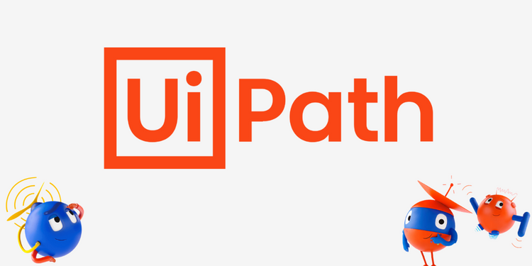

# RPA_UiPath

 Repository with all my RPA scripts based on UiPath, starting from Coursera course [Robotic Process Automation (RPA)](https://www.coursera.org/specializations/roboticprocessautomation).

 In the directory [Tutorials](Tutorials) all the test scripts based on the course are collected. 

 In the directory [StockPriceProject](StockPriceProject) a simple project based on the course is developed. In its [README file](StockPriceProject/README.md) the project code and goal is explained.

 In the directory [notes](notes) my hand-written course notes are collected. 
